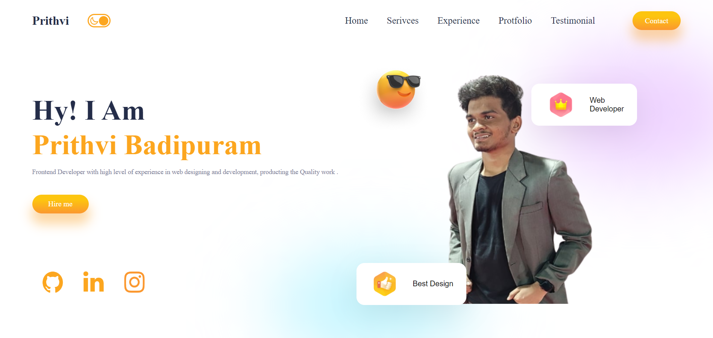
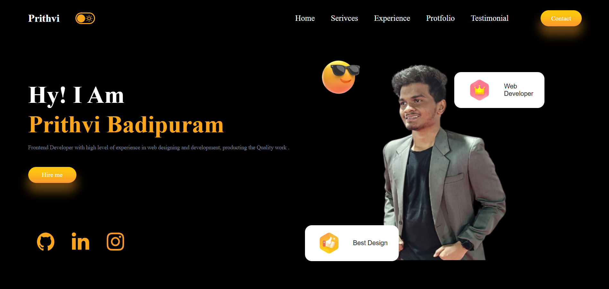
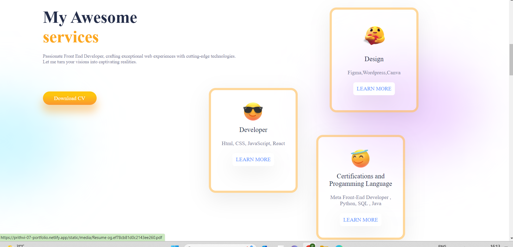
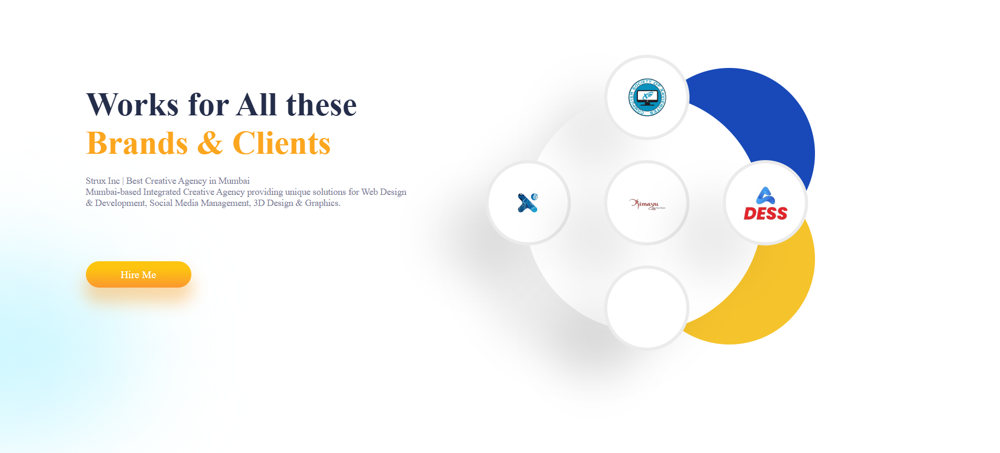
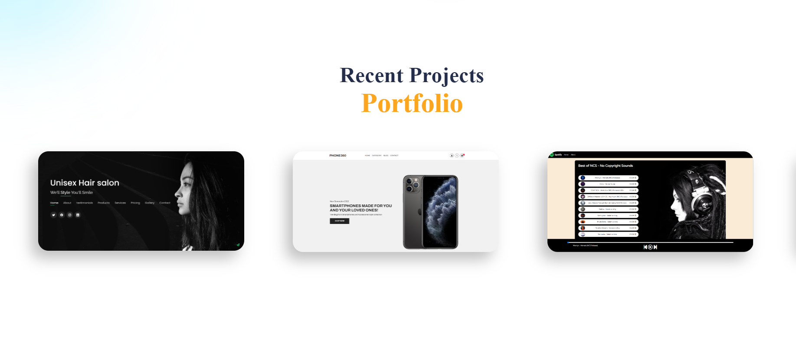
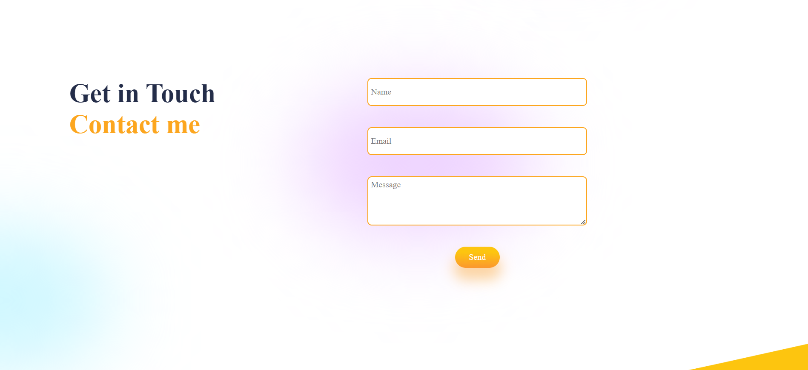
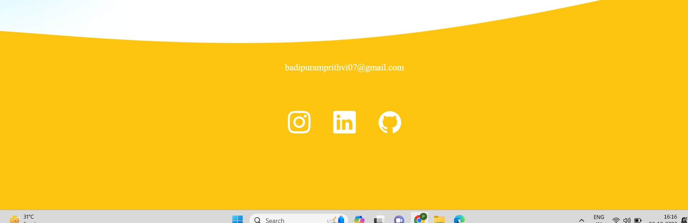

 <h1>Prithvi's Portfolio 🚀</h1>
<h3>Welcome to my portfolio repository! Here's a quick overview of what you'll find:</h3>
 <ul>
        <li><strong>About Me:</strong> Learn more about my passion and dedication in WebDevelopment.</li>
        <li><strong>Skills:</strong> Explore the key skills I bring to the table. 🛠️.</li>
        <li><strong>Projects:</strong> Check out some of my notable projects showcasing my expertise in Web Technolgies 🚧.</li>
        <li><strong>Work Experience:</strong> Get insights into my professional journey with experiences at [mention a few companies/organizations] 🏢.</li>
        <li><strong>Resume:</strong> Download my detailed resume to delve deeper into my education, skills, and work history.</li>
   <li><strong>Contact:</strong> Feel free to reach out to me via email at <a href="mailto:badipuramprithvi07@gmail.com">badipuramprithvi07@gmail.com 📧</a>.</li>
    </ul>

 
Thank you for visiting! I'm excited to connect with you. 🤝

 

 <h1>Preview of UI😍</h1>
 <h2>Home Page</h2>

<h2>Home Page in Darkmode</h2>

<h2>About me </h2>

<h2>Work Experience</h2>

<h2>My Projects</h2>

<h2>Contact me </h2>

<h2>Footer</h2>

